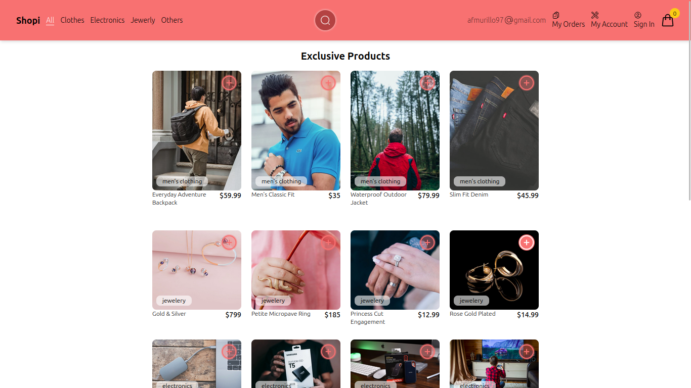
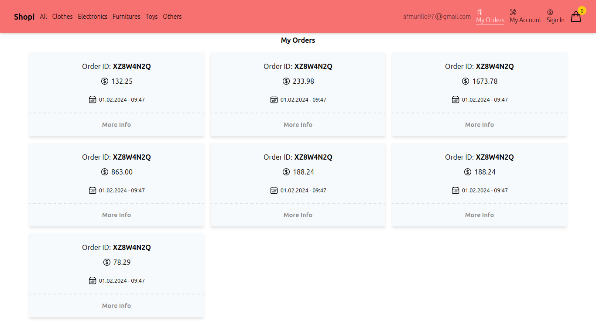
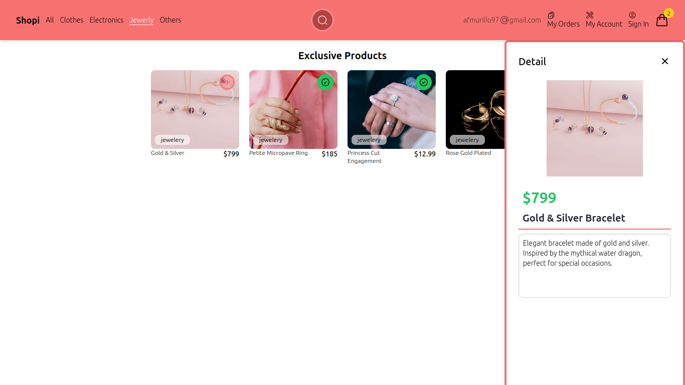
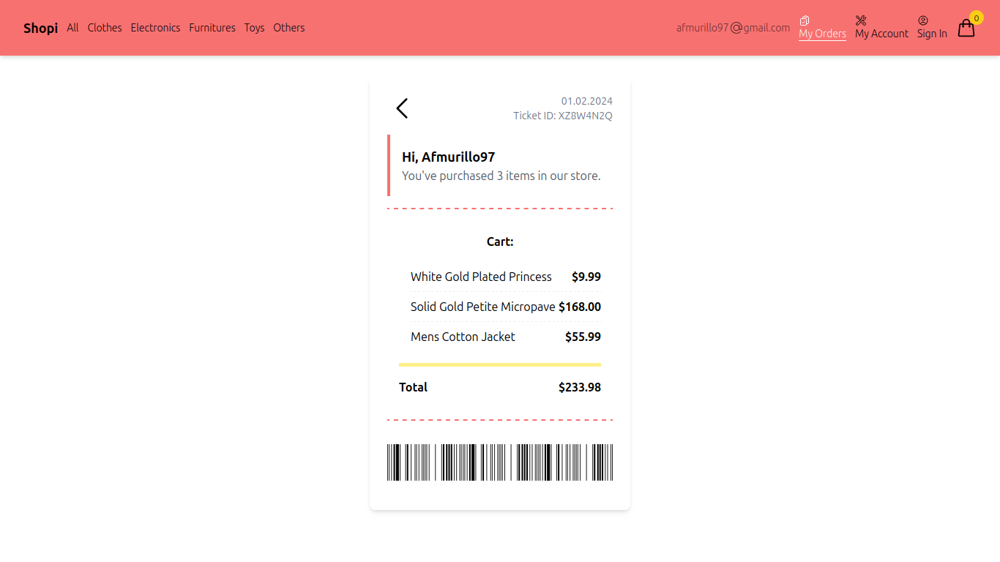

<!-- Improved compatibility of back to top link: See: https://github.com/othneildrew/Best-README-Template/pull/73 -->

<!--
*** Thanks for checking out the Best-README-Template. If you have a suggestion
*** that would make this better, please fork the repo and create a pull request
*** or simply open an issue with the tag "enhancement".
*** Don't forget to give the project a star!
*** Thanks again! Now go create something AMAZING! :D
-->

<!-- PROJECT SHIELDS -->
<!--
*** I'm using markdown "reference style" links for readability.
*** Reference links are enclosed in brackets [ ] instead of parentheses ( ).
*** See the bottom of this document for the declaration of the reference variables
*** for contributors-url, forks-url, etc. This is an optional, concise syntax you may use.
*** https://www.markdownguide.org/basic-syntax/#reference-style-links
-->
[![LinkedIn][linkedin-shield]][linkedin-url]

<!-- PROJECT LOGO -->
 

  

  <h3 align="center">React.js E-Commerce Store Project</h3>

  

    This E-Commerce Store is a modern and user-friendly online shopping platform built using React and Vite. It offers a smooth and intuitive experience for users to browse, search, and purchase products. This project showcases the power of React and modern web development tools.
     
    <a href="https://github.com/afmurillo97/react-store"><strong>Explore the docs »</strong></a>
     
     
    <a href="https://afmurillo97.github.io/react-store" target="_blank">View Project</a>
    ·
  

<!-- GETTING STARTED -->
## Getting Started with Create React App

This project was bootstrapped with [Vite](https://vitejs.dev/).

## Available Scripts

In the project directory, you can run:

### `npm run dev`

Runs the app in the development mode.\
Open [http://localhost:5173](http://localhost:5173) to view it in your browser.

The page will reload when you make changes.\
You may also see any lint errors in the console.

### `npm run build`

Builds the app for production to the `dist` folder.\
It correctly bundles React in production mode and optimizes the build for the best performance.

The build is minified and the filenames include the hashes.\
Your app is ready to be deployed!

### `npm run preview`

Previews the production build locally.

See the section about [deployment](https://vitejs.dev/guide/static-deploy.html) for more information.

## Screenshots

  
  
My Orders

  
  
  
Product Detail

  
  
  
Checkout Section

(<a href="#readme-top">back to top</a>)

# Built With

### React: A JavaScript library for building user interfaces.

* useState: For managing local component state.
* useEffect: For handling side effects, such as interacting with localStorage.
* useMemo: For optimizing performance by memoizing expensive calculations and components.
* React Context API: For managing global state across the application.

### JavaScript (ES6+): Leveraging modern JavaScript features for cleaner and more efficient code.

* Arrow Functions: For concise function expressions.
* Template Literals: For easier string interpolation.
* Destructuring Assignment: For extracting values from arrays and objects.
* Spread and Rest Operators: For easier manipulation of arrays and objects.

### API Consumption: This project consumes the FakeStore API to fetch product data.

* [FakeStore API](https://fakestoreapi.com/docs): A free API for e-commerce platforms, providing realistic product data for development and* testing purposes.

### This section should list any major frameworks/libraries used to bootstrap my project.

* [![React][React.js]][React-url]
* [![Javascript][Javascript.dev]][Javascript-url]
* [![HTML5][HTML5]][HTML5-url]
* [![CSS3][CSS3]][CSS3-url]

(<a href="#readme-top">back to top</a>)

<!-- LICENSE -->
## License

Distributed under the MIT License. See `LICENSE.txt` for more information.

(<a href="#readme-top">back to top</a>)

<!-- CONTACT -->
## Contact

Felipe Murillo - [@murilloaf](https://twitter.com/murilloaf) - afmurillo97@gmail.com

Project Link: [https://github.com/afmurillo97/react-store](https://github.com/afmurillo97/react-store)

(<a href="#readme-top">back to top</a>)

<!-- ACKNOWLEDGMENTS -->
## Acknowledgments

I'd like to express my gratitude to the following libraries and tools that have been instrumental in the development of TODO Machine:

* [React](https://reactjs.org) - A JavaScript library for building user interfaces.
* [React Router](https://reactrouter.com) - Declarative routing for React applications.
* [Vite](https://vitejs.dev/) - Next Generation Frontend Tooling.
* [Tailwind CSS](https://tailwindcss.com/) - A utility-first CSS framework for rapid UI development.
* [Heroicons](https://heroicons.com/) - Beautiful, hand-crafted SVG icons.
* [React Icons](https://react-icons.github.io/react-icons/) - Include popular icons in your React projects easily.
* [ESLint](https://eslint.org) - A tool for identifying and fixing problems in JavaScript code.
* [Prettier](https://prettier.io) - An opinionated code formatter.
* [Webpack](https://webpack.js.org) - A module bundler for JavaScript applications.

These resources have significantly contributed to the success and functionality of the E-Commerce Store project.

(<a href="#readme-top">back to top</a>)

<!-- MARKDOWN LINKS & IMAGES -->
<!-- https://www.markdownguide.org/basic-syntax/#reference-style-links -->
[contributors-shield]: https://img.shields.io/github/contributors/othneildrew/Best-README-Template.svg?style=for-the-badge
[contributors-url]: https://github.com/othneildrew/Best-README-Template/graphs/contributors
[forks-shield]: https://img.shields.io/github/forks/othneildrew/Best-README-Template.svg?style=for-the-badge
[forks-url]: https://github.com/othneildrew/Best-README-Template/network/members
[stars-shield]: https://img.shields.io/github/stars/othneildrew/Best-README-Template.svg?style=for-the-badge
[stars-url]: https://github.com/othneildrew/Best-README-Template/stargazers
[issues-shield]: https://img.shields.io/github/issues/othneildrew/Best-README-Template.svg?style=for-the-badge
[issues-url]: https://github.com/othneildrew/Best-README-Template/issues
[license-shield]: https://img.shields.io/github/license/othneildrew/Best-README-Template.svg?style=for-the-badge
[license-url]: https://github.com/othneildrew/Best-README-Template/blob/master/LICENSE.txt
[linkedin-shield]: https://img.shields.io/badge/-LinkedIn-black.svg?style=for-the-badge&logo=linkedin&colorB=555
[linkedin-url]: https://www.linkedin.com/in/felipe-murillov/
[product-screenshot]: images/screenshot.png
[Next.js]: https://img.shields.io/badge/next.js-000000?style=for-the-badge&logo=nextdotjs&logoColor=white
[Next-url]: https://nextjs.org/
[React.js]: https://img.shields.io/badge/React-20232A?style=for-the-badge&logo=react&logoColor=61DAFB
[React-url]: https://reactjs.org/
[Vue.js]: https://img.shields.io/badge/Vue.js-35495E?style=for-the-badge&logo=vuedotjs&logoColor=4FC08D
[Vue-url]: https://vuejs.org/
[Angular.io]: https://img.shields.io/badge/Angular-DD0031?style=for-the-badge&logo=angular&logoColor=white
[Angular-url]: https://angular.io/
[Svelte.dev]: https://img.shields.io/badge/Svelte-4A4A55?style=for-the-badge&logo=svelte&logoColor=FF3E00
[Svelte-url]: https://svelte.dev/
[PHP.dev]: https://img.shields.io/badge/php-url?style=for-the-badge&logo=php&logoColor=%23FFFFFF&labelColor=%23777BB4&color=%23777BB4
[PHP-url]: https://php.net/
[Composer.dev]: https://img.shields.io/badge/composer-url?style=for-the-badge&logo=composer&logoColor=%23FFFFFF&labelColor=%23885630&color=%23885630
[Composer-url]: https://getcomposer.org
[Javascript.dev]: https://img.shields.io/badge/javascript-url?style=for-the-badge&logo=javascript&logoColor=%23FFFFFF&labelColor=%23F7DF1E&color=%23F7DF1E
[Javascript-url]: https://javascript.com
[Laravel.com]: https://img.shields.io/badge/Laravel-FF2D20?style=for-the-badge&logo=laravel&logoColor=white
[Laravel-url]: https://laravel.com
[Bootstrap.com]: https://img.shields.io/badge/Bootstrap-563D7C?style=for-the-badge&logo=bootstrap&logoColor=white
[Bootstrap-url]: https://getbootstrap.com
[JQuery.com]: https://img.shields.io/badge/jQuery-0769AD?style=for-the-badge&logo=jquery&logoColor=white
[JQuery-url]: https://jquery.com
[MySQL.com]: https://img.shields.io/badge/mysql-url?style=for-the-badge&logo=mysql&logoColor=%23FFFFFF&labelColor=%234479A1&color=%234479A1
[MySQL-url]: https://mysql.com 
[HTML5]: https://img.shields.io/badge/HTML5-E34F26?style=for-the-badge&logo=html5&logoColor=white
[HTML5-url]: https://developer.mozilla.org/en-US/docs/Web/Guide/HTML/HTML5
[CSS3]: https://img.shields.io/badge/CSS3-1572B6?style=for-the-badge&logo=css3&logoColor=white
[CSS3-url]: https://developer.mozilla.org/en-US/docs/Web/CSS

